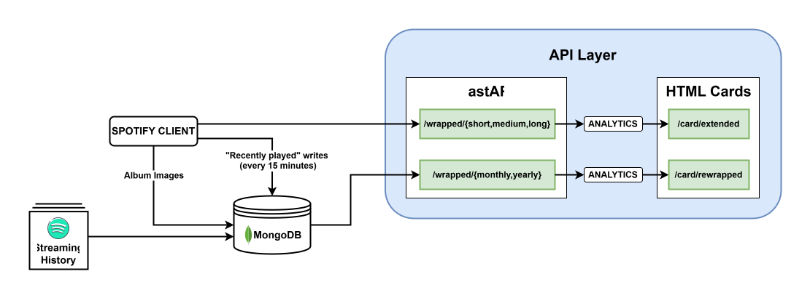

# Rewrapped

- Dockerized FastAPI service that assembles a Spotify Wrapped-style report using the Spotify Web API.
- Simple card UI at `/card/rewrapped` showing number of plays, number of unique tracks, top artists, top tracks, top albums and so on. This is available on a month and year level.
- Even simpler card UI art `/card/extended` showing top artists and top tracks over a short, medium and long time bucket as defined by spotify. Also includes basic theme color switching because why not?

<p align="left">
  
</p>

## Setup (Spotify OAuth)

1) Create a Spotify app in the [Dashboard](https://developer.spotify.com/dashboard).
2) Add the exact callback URL configured as `SPOTIFY_REDIRECT_URI`, such as `http://localhost:8000/spotify/callback` locally or `https://your-app.example/spotify/callback` in production.
3) Configure the variables in `.env.example`. Use a long random value for `SPOTIFY_OAUTH_ADMIN_PASSWORD` because the login route can replace the stored Spotify authorization.
4) Start the app and visit `/spotify/login`. Enter the configured HTTP Basic username/password and authorize Spotify. The callback stores the refresh token in MongoDB.

When Spotify expires the refresh token, API calls and scheduled ingestion fail with a reauthorization message. Visit `/spotify/login` again to replace it.
Use HTTPS for the login and callback routes in production.

### MongoDB (for stored plays)

- Provision a MongoDB database (Atlas or self-hosted).
- Add these env vars alongside the Spotify vars:
  - `MONGODB_URI` (SRV or standard connection string)
  - `MONGODB_DB` (default: `rewrapped`)
  - `MONGODB_COLLECTION` (default: `plays`)
  - `SPOTIFY_TOKEN_COLLECTION` (default: `spotify_tokens`)
- Plays are keyed by `played_at` and upserted, so the collection will not contain overlapping/duplicate items.

## Run locally

1) Populate `.env` (see `.env.example`) and either

    (i) Start the API in Terminal:
      ```bash
      python -m venv .venv && source .venv/bin/activate  # or .venv\Scripts\activate on Windows
      pip install -r requirements.txt
      uvicorn app.main:app --reload
      ```
    (ii) Use Docker:
      ```bash
      docker build -t rewrapped .
      docker run --env-file .env -p 8000:8000 rewrapped
      ```

## Deploy on Render

1) Clone this repo or push a local version of it to GitHub (do not commit your `.env`; keep it local).
2) In Render, create a new Web Service from the repo, choose Docker as the runtime.
3) Set the variables from `.env.example`, using the Render callback URL for `SPOTIFY_REDIRECT_URI` and a strong `SPOTIFY_OAUTH_ADMIN_PASSWORD`.
4) Add that exact callback URL in the Spotify developer dashboard.
5) Deploy, visit `/spotify/login`, and complete authorization once.


## Data Ingestion
### Scheduled ingestion (GitHub Actions)

This implements continuous syncing. A workflow at `.github/workflows/ingest.yml` runs every 15 minutes (and can be triggered manually) to pull the most recent Spotify plays and store them in MongoDB without overlaps:

- Add repository secrets: `SPOTIFY_CLIENT_ID`, `SPOTIFY_CLIENT_SECRET`, `MONGODB_URI`, and optionally `MONGODB_DB`, `MONGODB_COLLECTION`, `SPOTIFY_TOKEN_COLLECTION`.
- Add the repository variable `SPOTIFY_REAUTH_URL` with the public `/spotify/login` URL. A failed workflow will point you there when authorization expires.
- `SPOTIFY_REFRESH_TOKEN` is no longer used by the workflow and can be removed from repository secrets.
- The workflow executes `python -m app.ingest_recent`, which upserts plays by `played_at` and keeps indexes fresh.

### Data Dump
Optionally request your entire spotify listening history from Spotify via their [privacy page](https://www.spotify.com/us/account/privacy/). This can take a while. Once you have it:
- Run the command below. This may take a while; take a break.
  ```bash
  python -m app.ingest_dump "{path_to_dir}/Streaming_History_Audio*.json"
  ```
- Unfortunately, the Spotify dump does not include album cover images and album IDs. To fix that, run the commands below. Be careful with the `batch_size` (default 1000) as you do not want to exceed Spotify's rate limit.
  ```bash
  python -m app.backfill_images batch_size wait_time
  python -m app.backfill_album_ids batch_size wait_time
  ```


## API

- `GET /spotify/login`
  Owner-only HTTP Basic entry point for Spotify authorization.
- `GET /spotify/callback`
  Spotify callback that validates OAuth state and stores the new refresh token in MongoDB.
- `GET /wrapped/short?top_limit=50&recent_limit=50`  
  Short-term (~4 weeks) top tracks/artists plus the small recent playback window Spotify exposes (about the last 50 plays).
- `GET /wrapped/medium?top_limit=50`  
  Medium-term (~6 months) top tracks and artists.
- `GET /wrapped/long?top_limit=50`  
  Long-term (multi-year) top tracks and artists.
- `GET /wrapped/yearly?year=2024&limit=20`  
  Wrapped view backed by stored plays in MongoDB for a full calendar year. Defaults to the previous calendar year if omitted.
- `GET /wrapped/monthly?month=11&year=2024&limit=20`  
  Wrapped view backed by stored plays in MongoDB for a specific month/year. Defaults to the previous calendar month if omitted. Returns play counts, minutes, and top tracks/artists/albums (albums are included when available).

### Basic UI
- `GET /card`  
  Simple HTML card that visualizes top tracks and artists side by side. Uses `/wrapped/{short|medium|long}` under the hood; adjust range and limit via the UI controls.
- `GET /card/extended`  
  Themed version of the card with selectable styles plus range and limit controls.
- `GET /card/rewrapped`  
  Card powered by stored MongoDB plays. Toggle month vs year view, choose period and limit; shows top tracks, artists, and albums with play counts and minutes listened.

## Low Hanging Fruits 🍎
- Multi-year stats endpoint and dashboard.
- A more interesting dashboard using the API
